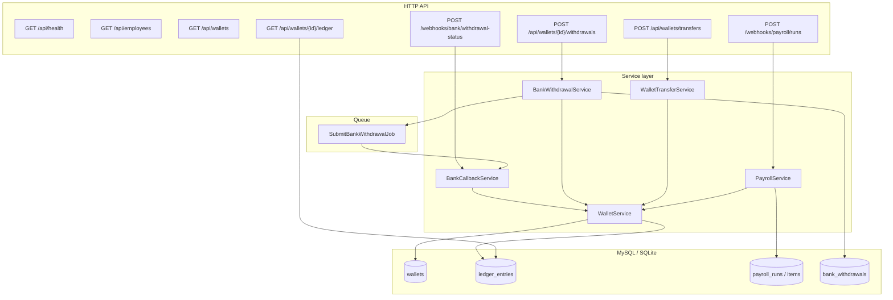

# Employee Wallet & Payroll Integration Service

A Laravel monolith that credits employee salary wallets from payroll webhooks, moves funds between an employee’s wallets, and processes outbound bank withdrawals with fund holds, async bank simulation, and idempotent callbacks.

Amounts are stored as **integer cents** (e.g. `50000` = $500.00).

## Architecture



### Layer responsibilities

| Layer | Responsibility |
|--------|----------------|
| **Controllers** | HTTP validation, JSON responses only |
| **WalletService** | All balance + ledger mutations (`lockForUpdate`, transactions) |
| **WalletTransferService** | Same-employee transfer rules → delegates to `WalletService` |
| **PayrollService** | Idempotent payroll runs → credit salary wallets |
| **BankWithdrawalService** | Initiate withdrawal, hold funds, queue bank submission |
| **BankCallbackService** | Apply bank result: settle or release hold |
| **Ledger** | Immutable append-only history; every wallet change has a row |

## Design decisions

### Why ledger + cached balance?

The system keeps immutable ledger entries for auditability while also storing cached balances on wallets for efficient reads.

- **Ledger** = source of audit history  
- **Wallet balance column** = optimized read model (available balance)  
- Both are updated **atomically in the same transaction** inside `WalletService`.

Ledger entries provide a complete audit trail and can be replayed to reconstruct wallet state; production reads use the cached available balance column.

### Why `locked_balance`?

Withdrawals are asynchronous. Funds committed to pending withdrawals are moved from **available balance** to **locked balance** so they cannot be spent twice while waiting for bank confirmation.

- **Hold** — `available_balance ↓`, `locked_balance ↑`  
- **Bank success** — `locked_balance ↓` (money left the platform)  
- **Bank failure** — `available_balance ↑`, `locked_balance ↓` (hold released)

### Why row locking?

Wallet updates use `SELECT … FOR UPDATE` to avoid race conditions during concurrent credits, debits, transfers, and withdrawal holds. Transfers lock **both wallets in ascending `id` order** to prevent deadlocks.

### Why per-item payroll transactions?

A whole payroll run is idempotent at the run level, but each line item is applied in its own transaction. If item 3 fails, items 1–2 stay credited and a retry skips completed items. This trades all-or-nothing atomicity for **safe retries** from unreliable payroll webhooks.

### Wallet balances (terminology)

| DB column | Documentation name | Meaning |
|-----------|---------------------|---------|
| `wallets.balance` | **available_balance** | Spendable funds |
| `wallets.locked_balance` | **locked_balance** | Held for in-flight withdrawals |
| — | **total_balance** | `available_balance + locked_balance` |

API responses use `available_balance`; the database column remains `balance` for brevity.

### Ledger entries

Each row records:

- `type` — e.g. `payroll_credit`, `withdrawal_hold`, `transfer_out`
- `amount` — change to **available** balance (signed)
- `balance_after` — available balance after the entry
- `reason` — human-readable description (`LedgerReason` helper)
- `metadata` — `available_delta`, `locked_delta`, `available_balance_after`, `locked_balance_after`, `total_balance_after`, plus domain IDs

## Indexing

Key indexes supporting idempotency and history queries:

| Table | Index | Purpose |
|-------|--------|---------|
| `wallets` | `(employee_id, type)` unique | One salary/savings wallet per employee |
| `ledger_entries` | `(wallet_id, created_at)` | Paginated transaction history |
| `ledger_entries` | `(wallet_id, id)` | Newest-first pagination |
| `payroll_runs` | `idempotency_key` unique | Payroll dedupe |
| `payroll_runs` | `external_event_id` unique | Alternate payroll dedupe |
| `payroll_items` | `(payroll_run_id, employee_id)` unique | Line-item dedupe |
| `bank_withdrawals` | `idempotency_key` unique | Withdrawal request dedupe |
| `bank_withdrawals` | `(wallet_id, status)` | Ops / reconciliation queries |
| `bank_callbacks` | `idempotency_key` unique | Callback dedupe |
| `bank_callbacks` | `external_event_id` unique | Alternate callback dedupe |

## Idempotency

| Flow | Key | Behavior on duplicate |
|------|-----|------------------------|
| Payroll run | `idempotency_key`, `external_event_id` | Returns existing run; no double credit |
| Payroll item | `(payroll_run_id, employee_id)` | Skips if already completed |
| Withdrawal request | `idempotency_key` | Returns existing withdrawal; re-queues job if still `pending` |
| Bank callback | `idempotency_key`, `external_event_id` | No-op if withdrawal already terminal |

Callbacks are retry-safe through idempotency keys and terminal-state checks on the withdrawal record.

## Concurrency

- All wallet updates use `SELECT … FOR UPDATE` on wallet rows (ordered by id for transfers).
- `WalletService` joins the caller’s transaction when one is already open (no nested commit bugs).
- Withdrawal jobs use `afterCommit()` so the queue only runs after the hold is persisted.
- Payroll processes each item in its own transaction so partial runs can be retried safely.

## Wallet transfer

Transfers are **same-currency, same-employee only** (e.g. salary → savings).

**Flow:**

1. Lock wallet A and wallet B (`id` ascending)  
2. Wallet A — ledger `transfer_out` (available debit)  
3. Wallet B — ledger `transfer_in` (available credit)  

Both legs run in a single database transaction via `WalletService::transfer()`.

**Endpoint:** `POST /api/wallets/transfers`

```json
{
  "from_wallet_id": 1,
  "to_wallet_id": 2,
  "amount": 50000
}
```

## Assumptions

- Single currency (USD), single region, monolith deployment.
- One **salary** wallet per employee (payroll credits this wallet); optional **savings** wallet for transfers.
- External systems (payroll, bank) may retry, duplicate, or arrive late.
- Bank integration is simulated in-process (job calls `BankCallbackService` directly); the webhook uses the same code path.
- No authentication on API routes (add Sanctum/API keys for production).

## Tradeoffs

| Choice | Benefit | Cost |
|--------|---------|------|
| Cached available balance + ledger | Fast reads, simple queries | Must always update both in one transaction |
| Hold model (`locked_balance`) | Clear available vs pending; prevents double spend | Extra column and ledger types |
| Per-item payroll transactions | Safe partial retry | Not atomic “all or nothing” for a whole run |
| `bank_callbacks` table | Audit + callback dedupe | Extra table vs only using withdrawal status |
| Sync queue in dev/tests | Simple local UX | Use Redis/database queue in production |

## Requirements

- PHP 8.2+
- Composer
- SQLite (default) or MySQL 8+

## Run locally

```bash
cd employee-wallet
composer install
cp .env.example .env   # if needed
php artisan key:generate
touch database/database.sqlite
php artisan migrate
php artisan db:seed    # emp-alice, emp-bob: salary + savings wallets
php artisan serve
```

Optional queue worker (`database` or `redis` driver):

```bash
php artisan queue:work
```

With `QUEUE_CONNECTION=sync` (default in tests), jobs run inline during the request.

### Configuration

| Variable | Default | Purpose |
|----------|---------|---------|
| `BANK_SIMULATE_SUCCESS` | `true` | Job simulates successful bank callback |
| `QUEUE_CONNECTION` | `sync` | Set to `database` for real async |

## API overview

| Method | Path | Description |
|--------|------|-------------|
| `GET` | `/api/health` | Liveness check |
| `GET` | `/api/employees` | Employee dashboard list (`search`, pagination) |
| `GET` | `/api/employees/{id}` | Employee details with wallets |
| `GET` | `/api/wallets` | Wallet dashboard list (`employee_id`, `type`, pagination) |
| `POST` | `/api/webhooks/payroll/runs` | Ingest payroll run |
| `POST` | `/api/wallets/transfers` | Transfer between same-employee wallets |
| `GET` | `/api/wallets/{wallet}/ledger` | Paginated transaction history (newest first) |
| `POST` | `/api/wallets/{wallet}/withdrawals` | Request withdrawal |
| `GET` | `/api/wallets/{wallet}/withdrawals/{id}` | Withdrawal status |
| `POST` | `/api/webhooks/bank/withdrawal-status` | Bank callback |

**Dashboard query params**

- `GET /api/employees` — `page`, `per_page`, `search` (matches `name` or `external_ref`)
- `GET /api/wallets` — `page`, `per_page`, `employee_id`, `type` (`salary` \| `savings`)

Employee create/update/delete endpoints were not implemented; read-only dashboards cover the assignment’s list/filter/pagination requirement while keeping scope on payment flows.

### Health

```bash
curl -s http://127.0.0.1:8000/api/health
# {"status":"ok"}
```

### Transaction history

```bash
curl -s "http://127.0.0.1:8000/api/wallets/1/ledger?page=1"
curl -s "http://127.0.0.1:8000/api/wallets/1/ledger?type=withdrawal_settled&page=1"
```

Query params: `page`, `per_page` (max 100), `type` (any `LedgerEntryType` value). Ordered **newest → oldest** by `id`.

---

## Test flows

### 1. Payroll credit

List wallets after seeding:

```bash
php artisan tinker --execute="
App\Models\Wallet::with('employee')->get(['id','employee_id','type','balance','locked_balance']);
"
```

Credit via webhook:

```bash
curl -s -X POST http://127.0.0.1:8000/api/webhooks/payroll/runs \
  -H "Content-Type: application/json" \
  -d '{
    "idempotency_key": "payroll-demo-001",
    "external_event_id": "evt-payroll-demo-001",
    "items": [
      {"employee_external_ref": "emp-alice", "amount": 250000, "external_item_id": "line-1"},
      {"employee_external_ref": "emp-bob", "amount": 180000, "external_item_id": "line-2"}
    ]
  }' | jq
```

Replay the same payload — `"duplicate": true`, balances unchanged.

### 2. Wallet transfer (salary → savings)

```bash
# After seed: alice salary wallet id=1, savings id=2 (order may vary — check tinker)
curl -s -X POST http://127.0.0.1:8000/api/wallets/transfers \
  -H "Content-Type: application/json" \
  -d '{"from_wallet_id": 1, "to_wallet_id": 2, "amount": 100000}' | jq
```

### 3. Withdrawal (hold → bank → settle)

```bash
WALLET_ID=1

curl -s -X POST "http://127.0.0.1:8000/api/wallets/${WALLET_ID}/withdrawals" \
  -H "Content-Type: application/json" \
  -d '{"amount": 100000, "idempotency_key": "withdraw-demo-001"}' | jq
```

Set `BANK_SIMULATE_SUCCESS=false` in `.env` to exercise failure and fund release.

Manual bank callback (when withdrawal is `processing` with a `bank_reference`):

```bash
curl -s -X POST http://127.0.0.1:8000/api/webhooks/bank/withdrawal-status \
  -H "Content-Type: application/json" \
  -d '{
    "bank_reference": "manual-bank-ref",
    "status": "completed",
    "idempotency_key": "cb-manual-001",
    "external_event_id": "evt-manual-001"
  }' | jq
```

### 4. Automated tests

```bash
php artisan test
php artisan test --filter=Wallet
php artisan test --filter=Payroll
php artisan test --filter=Bank
php artisan test --filter=Api
```

## Project structure

```
app/
  Services/
    Wallet/WalletService.php           # sole balance mutator
    Wallet/WalletTransferService.php   # transfer policy
    Payroll/PayrollService.php
    Bank/BankWithdrawalService.php
    Bank/BankCallbackService.php
  Support/LedgerReason.php
  Jobs/SubmitBankWithdrawalJob.php
  Http/Controllers/Api/               # health, transfer, ledger, withdrawal
  Http/Controllers/Webhooks/          # payroll, bank
database/migrations/
tests/Feature/                        # Wallet, Payroll, Bank, Api
```

## Future improvements

- Transfer idempotency keys and `wallet_transfers` audit table  
- Reconciliation jobs for stuck `processing` withdrawals  
- FX conversion service for multi-currency wallets  
- Outbox pattern for reliable external integration delivery  
- Retry policies + dead-letter queues for bank submission  
- Webhook HMAC signatures (payroll + bank)  
- Redis queue + horizontal workers in production  
- Read replicas / reporting views off the ledger  

## Deliverables

Included in this repository:

- **Source code** — Laravel application (`app/`, `routes/`, `config/`)
- **Migrations** — `database/migrations/`
- **Tests** — `tests/Feature/` (wallet, payroll, bank, API)
- **Postman collection** — `postman/employee-wallet.postman_collection.json`

Import the collection into Postman and set `base_url` to `http://127.0.0.1:8000`. It includes requests for:

- Health check and dashboard reads (employees, wallets, ledger)
- Payroll run (including duplicate replay)
- Wallet transfer (salary → savings)
- Withdrawal request
- Bank callback (completed and failed)

## Production checklist (not implemented)

- API authentication  
- Dead-letter handling for failed queue jobs  
- MySQL `READ COMMITTED` tuning under load  
- Structured logging on idempotent skips and hold metrics  
